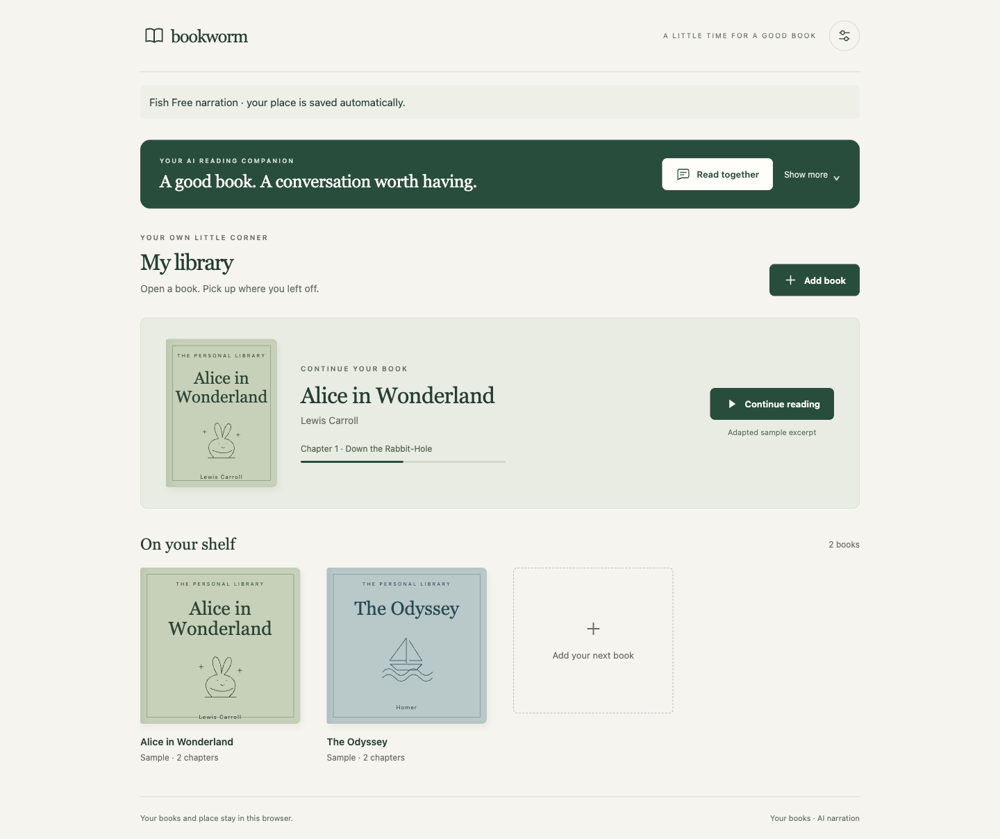

# BookWormAI

One reader for your own books: add a DRM-free EPUB or TXT file, discover books on
Project Gutenberg, listen with OpenRouter or OpenAI, and resume where you stopped.
The simplified reader is the only application. Local and Cloudflare builds share its source.



**Read together** brings an AI companion to your current passage. Expand **Show more**
for discussion ideas, or open the companion directly from the homepage or reader.

## Choose how to get started

| What you want to do | Where to start |
| --- | --- |
| Try a demo shared by a teammate | Open their link in your browser. No software installation is needed. |
| Run BookWormAI on your own computer | Follow the first-time setup below. You do not need coding experience or Git. |
| Work on the code | Use the Git option below, then see “Checks for contributors.” |

Reading and importing books do not need an AI key. Narration needs your own
OpenRouter or OpenAI API key and an internet connection. A provider may require
credits or impose usage limits. Your demo setup and local setup are separate.

## First-time setup on your computer

Allow time for the first download. You will install two tools: **Node.js** runs the
app, and **pnpm** downloads the software packages the app needs (“dependencies”).

### 1. Install Node.js

Open the [official Node.js download page](https://nodejs.org/en/download), select
**Node.js 22 LTS**, and use the latest available patch in that line. The project
requires Node.js **22.14 or newer** and pins pnpm to **11.0.9**.

| Your computer | How to install Node.js | Where to type commands afterward |
| --- | --- | --- |
| macOS | Choose the macOS `.pkg` installer and follow its prompts. | Open **Terminal** using Spotlight (Command + Space). |
| Windows | Choose the Windows `.msi` installer and follow its prompts. Keep npm and PATH options enabled. | Open **Command Prompt** from the Start menu. The Windows examples below use Command Prompt. |
| Linux | Select Linux on the Node.js download page and follow its installation instructions for Node.js 22. | Open your distribution’s **Terminal** app. |

Close and reopen the terminal after installation. Type each command below and
press Enter after each line. Do not copy the surrounding code-box markers.

```sh
node --version
npm --version
```

Both commands should print a version number. If either says “command not found” or
“not recognized,” reopen the terminal or finish the Node.js installation first.

### 2. Install pnpm

Run this once, on any of the platforms above:

```sh
npm install --global pnpm@11.0.9
pnpm --version
```

The second command should print `11.0.9`. We use npm only to install pnpm; use pnpm
for BookWormAI’s dependencies. If installation reports a permissions error, see
“Troubleshooting” below. The project pins this version; generic instructions on the
[pnpm installation page](https://pnpm.io/installation) may describe a newer release.

### 3. Download BookWormAI

**Without Git — recommended for first-time users:**

1. Open the [BookWormAI repository](https://github.com/G4ertner/BookWormAI).
2. Make sure the branch selector says **main**.
3. Click the green **Code** button, then **Download ZIP**.
4. Extract the ZIP: double-click it on macOS, use **Extract All** on Windows, or
   your archive manager on Linux. You must extract it before continuing.
5. Open the extracted folder. You should see `README.md` and `package.json` together.

These steps follow [GitHub’s source-download guide](https://docs.github.com/en/repositories/working-with-files/using-files/downloading-source-code-archives).

In your terminal, enter that folder. If you extracted it into Downloads without
renaming it, use the matching command:

**macOS / Linux:**

```sh
cd "$HOME/Downloads/BookWormAI-main"
```

**Windows Command Prompt:**

```bat
cd /d "%USERPROFILE%\Downloads\BookWormAI-main"
```

If you saved it somewhere else, replace the path with that folder’s actual path.
Keep the quotes around paths containing spaces. On Windows you can copy the folder
path from File Explorer’s address bar. On macOS you can type `cd ` and drag the
extracted folder into Terminal, then press Enter.

**With Git — for contributors who already have Git installed:**

```sh
git clone https://github.com/G4ertner/BookWormAI.git
cd BookWormAI
```

Choose either ZIP or Git; you do not need both.

### 4. Install the app’s dependencies

From the folder containing `package.json`, run:

```sh
pnpm install --frozen-lockfile
```

Wait until the command finishes and the terminal prompt returns. This downloads
the required packages into `node_modules`; you do not install them individually.
The lockfile keeps teammates on the same package versions. The project also has a
24-hour minimum package release age configured in `pnpm-workspace.yaml`.

### 5. Start the app

In the same terminal and folder, run:

```sh
pnpm dev
```

This builds the app and starts a local server. When the terminal shows
`BookWormAI audio: http://127.0.0.1:4310`, open
**[http://127.0.0.1:4310/](http://127.0.0.1:4310/)** in your browser.
You should see **My library** and sample books.

Keep that terminal open while using the app. The address works on this computer;
it is not a shareable website link. Do not double-click the HTML source file.
Existing `/simple/` links open the same reader.

### 6. Connect narration

1. From **My library**, open **Reader settings**.
2. Choose the narration model: Fish uses **OpenRouter**; OpenAI voices use **OpenAI**.
3. Paste the matching provider’s API key into its field and click **Save**.
4. Choose a voice if available, then click **Apply model and voice**.
5. Open a sample book and press **Play** to test the connection.

An API key is a private credential from your provider’s developer dashboard. Keep
it out of chat messages, screenshots and Git commits. You only need the key for
the provider you choose. “Key saved” confirms storage; Play checks whether the
provider accepts it.

For normal local setup, use the popup; no `.env` editing is needed. Advanced users
can copy `.env.example` to `.env` and fill in a provider key. Do not overwrite an
existing `.env`. Keys saved in settings override environment keys.

## Stop, reopen or update

- **Stop:** select the running terminal and press **Ctrl + C** (also on macOS).
- **Reopen later:** open a terminal in the same project folder, run `pnpm dev`,
  and open the same browser address. You do not reinstall Node.js or pnpm each time.
- **After a Git update:** stop the app, run `git pull --ff-only`, then
  `pnpm install --frozen-lockfile` and `pnpm dev`. If you have local edits, resolve
  them before updating; do not discard them just to make the command succeed.
- **After a ZIP update:** extract the new download to a separate folder and repeat
  steps 4–6 there. Keep the old folder until the new copy works. Local server keys
  belong to the old folder, so enter them again in the new copy’s settings.

Use the same browser profile and exact address to retain your library and progress.
Clearing that site’s browser data removes them. Books are not automatically backed up;
keep the original EPUB/TXT files.

## Troubleshooting

| What you see | What to do |
| --- | --- |
| `node`, `npm` or `pnpm` is not recognized | Reopen the terminal, then check steps 1–2. |
| `package.json` cannot be found | You are in the wrong folder. Use `cd` to enter the extracted/cloned folder containing `package.json`. |
| A Node.js version error | Run `node --version`; install Node.js 22 LTS with a patch version at least 22.14. |
| Package downloads fail | Check your internet connection, then retry `pnpm install --frozen-lockfile`. If it still fails, share the error text with a teammate, without keys. |
| A lockfile or dependency-build approval error | Confirm you downloaded one complete main revision and are using pnpm 11.0.9. Ask a maintainer to check the lockfile/build allowances; do not delete the lockfile or approve every script. |
| The browser says it cannot connect | Confirm `pnpm dev` is still running and use the exact address printed in the terminal. |
| Port 4310 is already in use | Stop the earlier BookWormAI terminal with Ctrl + C before starting another copy. |
| Key rejected, quota exceeded or credits required | Check the selected provider and key in Reader settings, then check that provider’s account dashboard. |
| Browser storage is full | New changes may last only for this session. Keep your original book files; do not clear site data unless you intend to remove the saved library. |

**If installing pnpm globally fails with a permissions error**, you can run the
pinned pnpm through npm’s launcher instead. From the project folder, use:

```sh
npx --yes pnpm@11.0.9 install --frozen-lockfile
npx --yes pnpm@11.0.9 dev
```

These commands still use pnpm to install and run the project. Use the second
command again when reopening. Avoid changing system permissions just to install it.

Local browser acceptance has been performed on macOS with Node.js 22. Windows and
Linux instructions have not yet been tested on physical devices for this project.
Installation references above were checked on September 12, 2026.

## Use

- **Add book → From your device:** choose an EPUB or TXT file under 10 MB.
- **Add book → Project Gutenberg:** search by title/author, click Add, then choose
  the downloaded EPUB when prompted. If the picker does not open automatically,
  click “Choose the EPUB you just downloaded.”
- **Add book → For you:** describe a topic or mood to find Gutenberg book matches.
  Open **Recommendation settings**, paste your **Exa API key**, and choose **Save Exa key**.
  This works locally and on the hosted demo; narration keys are separate.
  Once you have added books of your own, **Find books like my shelf** searches from
  them in one click. It sends the titles and authors of your three newest books and
  fills them into the box so you can see what was sent; your book text is never sent.
  The sample books that ship with the reader are not used.
  Choose a result to continue through the existing Gutenberg import flow.
  See [recommendation setup and limits](docs/BOOK_RECOMMENDATIONS.md).
- Open the book on your shelf, select a chapter, and press Play. Narration prepares
  one passage at a time; speed, chapters, and saved position remain available.
- “Key saved” means stored, not accepted by the provider. Playback reports rejected
  credentials, credit/quota limits, and service errors separately.

Books and listening position stay in the same browser/origin. Localhost and the
hosted demo have separate libraries. EPUB front matter may be the first section;
use Chapters to select the story. Unsupported or encrypted EPUBs require a text export.

## Read together

Open a book and select **Read together**. Ask about the current passage, look back
at earlier passages, or discuss an interpretation. The companion uses
**Gemini 2.5 Flash through OpenRouter**, independently of your narration model.
Save an OpenRouter key in **Reader settings** to enable it.

**Through this passage** limits book retrieval to your current position. Choose
**The whole book** explicitly to discuss later sections. Model knowledge and web
sources may still contain spoilers. Book citations open a source preview without
moving your listening position; **Continue listening** returns to narration.

For outside facts or background, save your own **Exa API key** in Reader settings
and enable **Allow outside research** in the discussion. Locally, the existing
server-only `EXA_API_KEY` is used unless you save or remove a companion Exa key.
Hosted readers use their own expiring session keys; no shared Exa key is supplied.
Questions, relevant excerpts and recent discussion go to OpenRouter. Exa receives
a model-generated topic query when outside research is enabled. Your complete
library is not uploaded. The latest eight discussion turns are stored separately
in this browser. See [setup, limits and verification](docs/READING_COMPANION.md).

## Checks for contributors

```sh
pnpm check
# Optional live provider test against the running local server:
pnpm smoke:audio
```

`check` runs type checking, both builds, application tests, and Cloudflare tests.
Automated provider tests use fixtures. `smoke:audio` generates one short passage
using the selected provider and may consume quota/credit.

## Source map

| Path | Purpose |
| --- | --- |
| `src/simple/` | The sole reader UI and audio adapter |
| `src/books/` | Gutenberg catalog and bounded EPUB parsing |
| `src/audio/` | Playback, cache, resume, models and key-settings UI |
| `src/server/` | Shared speech provider; local and Cloudflare storage/HTTP adapters |
| `migrations/` | Existing Cloudflare D1 schema history |
| `tests/`, `scripts/` | Checks, build, sample EPUB generator and optional audio smoke |

See [architecture](docs/ARCHITECTURE.md) and [verification evidence](docs/VERIFICATION.md)
for implementation details and the recorded test results.
